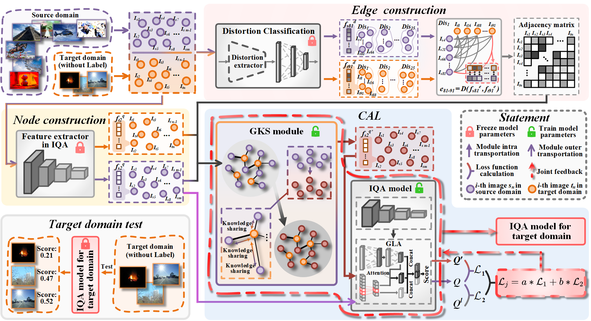

# GDCIQA
a cross-domain image quality assessment method
Code for GDCIQA


## Dataset
| Dataset   | Links                                                       |
| --------- | ----------------------------------------------------------- |
| TID2013      | http://www.ponomarenko.info/tid2013.htm     |
| KADID10K      | http://database.mmsp-kn.de/kadid-10k-database.html      |
| LIVE-C      | https://live.ece.utexas.edu/research/ChallengeDB/index.html      |
| CSIQ      | https://s2.smu.edu/~eclarson/csiq.html |
| KonIQ-10k   | http://database.mmsp-kn.de/koniq-10k-database.html |
| AGIQA     |  https://github.com/lcysyzxdxc/AGIQA-3k-Database |
## Requirements
- PyTorch=1.7.0
- Torchvision=0.8.1
- numpy=1.21.6
- scipy=1.7.3
- h5py=3.7.0
- opencv-python =4.7.0.72
- need to updown the weights of ViT, and name is with "pytorch_model.bin".
## Usages

### Swin Transformer Parameters
```
"swin_base_patch4_window7_224.pth" parameters are required from the open source official website of Pytorch.
```

####  Distortion Classification Model Pretrained Parameters
```
Train on KADID for "KADID10K_train_dis.pt".
```

####  IQA Model Pretrained Parameters
```
Train on KADID for "KADID10K_train_IQA.pt".
```

####  Co-adaptation Learning and Test on LIVE-C
```
Run "domain_kadid_to_livec".
```

Some available options:
* `--lr`: Learning rate.
* `--save_path`: Model and paramter save path.
* `--batch_size`: Batch size.
* `--epochs`:Epochs
* 
```
